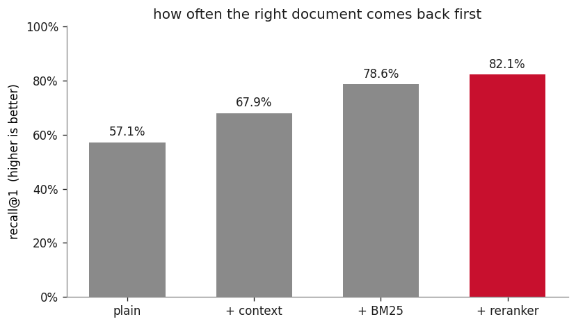

<div dir="rtl" lang="he" align="right" markdown="1">

# הנדסת AI בעברית

[](https://github.com/itayco2/AI-Engineering-in-Hebrew/actions/workflows/tests.yml)
[](https://github.com/itayco2/AI-Engineering-in-Hebrew/actions/workflows/notebooks.yml)
[](https://itayco2.github.io/AI-Engineering-in-Hebrew/)
[](LICENSE)

קורס שרץ בהנדסת `AI` מודרנית, בעברית. מורידים, מריצים, ורואים את המספרים נוצרים על המסך.

</div>

<p align="center">
  
</p>

<div dir="rtl" lang="he" align="right" markdown="1">

*כל ארבעת המספרים האלה מחושבים בפרק הראשון, על 46 מסמכים ו-28 שאלות, במחשב שלך.*

**מצב הקורס:** חמישה פרקים כתובים, רצים ונבדקים בכל `push`. גרסה `v1.0`.

## למה זה קיים

יש חומר מצוין על `RAG`, על `agents` ועל `evals`, וכמעט כולו באנגלית. בעברית יש ספר אחד טוב על למידה עמוקה קלאסית, ואין כלום על הערימה של 2026. הקורס הזה ממלא את החלק החסר.

## מה מיוחד כאן

**המספרים מחושבים, לא מצוטטים.** פרק שמשחזר תוצאה על קורפוס קטן שווה יותר מעשרה שמצטטים אותה ממאמר.

**מה שהיה שבור מתועד.** יש כאן קובץ שמפרט כל תקלה בדרך, עם המספר שחשף אותה והמספר אחרי התיקון. אחת מהן: ה-`reranker` החזיר `NaN` בשקט, לא זרק שגיאה, ופשוט לא עשה כלום. מדריך שמראה רק את הגרסה שעבדה מלמד חצי מהעבודה.

**הסבר בעברית, קוד באנגלית.** כל מונח מקצועי נשאר באנגלית בדיוק כמו שמהנדסים בישראל כותבים אותו, כדי שאפשר יהיה לחפש אותו בגוגל חמש דקות אחר כך. יש מילון שמחייב את כל הפרקים, והבדיקות נכשלות אם פרק ממציא מונח חדש.

**הכל נבדק.** כל פונקציה במנוע נבדקת בפחות משנייה בלי שום מודל, וכל פרק מורץ מקצה לקצה בכל `push`, כדי שפרק לא יירקב בשקט.

## להתחיל

</div>

```bash
git clone https://github.com/itayco2/AI-Engineering-in-Hebrew
cd AI-Engineering-in-Hebrew
make setup && make run-01
```

<div dir="rtl" lang="he" align="right" markdown="1">

הפקודה `make setup` משתמשת ב-`uv` אם הוא מותקן, ונופלת חזרה ל-`venv` ול-`pip` אם לא. כשמשהו לא עובד, `make gate` היא הפקודה שבודקת הכל בפחות מדקה ובדרך כלל אומרת מה הבעיה.

## הפרקים

| פרק | מה בונים | צריך מודל שפה |
|---|---|---|
| [**01: RAG מאפס**](chapters/01-rag/) | `chunking`, `embeddings`, `BM25`, `RRF`, `reranker`, ומדידה של כל שלב | לא |
| [**02: RAG בעברית**](chapters/02-hebrew-rag/) | מורפולוגיה עברית, עלות `tokens`, ואיזה `embedding` באמת עובד | לא |
| [**03: איך יודעים שזה עובד**](chapters/03-evals/) | `recall`, `nDCG`, ואיפה `LLM-as-judge` מפסיד להטלת מטבע | מוקלט |
| [**04: הנדסת הקשר**](chapters/04-context/) | למה סיכום עולה כסף, ומה ה-`cache` עושה לזה | מוקלט |
| [**05: סוכנים**](chapters/05-agents/) | הלולאה, `tool schemas`, ולמה מודלים קטנים שוברים `JSON` | מוקלט |

## כמה זה עולה

שום דבר, ולא בתור סיסמה. שני הפרקים הראשונים לא קוראים לאף מודל שפה, רק מודל `embedding` קטן שרץ על המעבד. אין `API key`, אין `GPU`, ואין דרישת זיכרון חריגה.

שלושת הפרקים האחרונים כן צריכים מודל שפה, והם רצים בכל זאת בלעדיו: כל תשובה של המודל הוקלטה פעם אחת ונשמרת בתוך הקורס. הרצה מלאה של כל חמשת הפרקים לוקחת כ-70 שניות ולא נוגעת ברשת.

מי שרוצה להריץ מול מודל אמיתי יכול, עם `Ollama` או עם `llama-cpp-python`. שניהם חינמיים ומקומיים.

## מה לא כתוב כאן, בכוונה

**פנימיות של מודלי שפה**: יש על זה חומר מצוין באנגלית, ומחברת צעצוע של `transformer` היא דבר שמאה ריפוזיטורים כבר עושים טוב יותר.

**הגשה ועלות בייצור**: דורש `vLLM` וחומרה, וסותר את ההבטחה שהכל רץ על לפטופ. החלק שבאמת משנה נמצא בפרק 04.

**`fine-tuning`**: דורש `GPU`.

## להפעיל את האתר

האתר נבנה ונבדק בכל `push`, אבל הוא מתפרסם רק כשמדליקים אותו במפורש. שלושה צעדים: להפוך את הריפו לציבורי, להפעיל `Pages` תחת `Settings` ואז `Pages` עם המקור `GitHub Actions`, ולהוסיף משתנה ריפו בשם `PAGES_ENABLED` עם הערך `true`.

עד אז שלב ה-`deploy` פשוט מדולג, ולא נכשל. סימן כשל קבוע ברשימת הבדיקות נקרא כמו פרויקט שבור, וכאן שום דבר לא שבור.

## קישורים

[הקורס באתר](https://itayco2.github.io/AI-Engineering-in-Hebrew/) · [מילון המונחים](TERMS.md) · [איך נמדדו המספרים](PREFLIGHT.md) · [לתרום](CONTRIBUTING.md) · [English](README.en.md)

</div>
